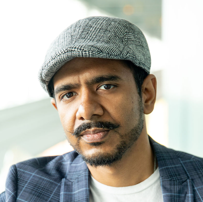

## About
We intend to bring together the FAccT community around the topic of AI for Humanitarian Development, in order to enable deep exploration of the challenges of developing, implementing, and regulating AI for the Global South. We will explore the above topic through a case study of a social enterprise supported by an international non-governmental organization (NGO) who are building AI to highlight the environmental and health challenges faced by children. The case study will discuss the implementation of AI to measure children's exposure in the global south to harmful air pollutants that can lead to respiratory illness. We will discuss several implementation challenges for this case study, including ground truthing, privacy and autonomy, and infrastructure constraints. At the end of the session, we want participants to have a better shared understanding of the path forward in co-developing humanitarian AI solutions for the Global South while tackling the above challenges collaboratively.

## Schedule
This CRAFT session will be held virtually, on **June 15, 2023 10:15 - 11:45 US Central time**. The collaborative activities will be aimed at facilitating a participatory conversation. We enable this through a mix of large group discussions and small group breakout sessions.

| Time (CT) | Event |
|---|---|
| 10:15 - 10:20 | Opening & Icebreakers |
| 10:20 - 10:25 | (Presentation) Summary and intended outcomes |
| 10:25 - 10:35 | (Group brainstorm) Examples of Humanitarian AI, benefits and harms |
| 10:35 - 11:05 | (Panel) Needs, efforts, and challenges in humanitarian AI for the Global South | 
| 11:05 - 11:25 | Breakout activity + report out | 
| 11:25 - 11:40 | Group-wide discussion | 
| 11:40 - 11:45 | Call to action and concluding remarks |

## Panelists

|  |  |  |  
| :-------------: | :-------------: | :-------------: | 
|  |  |   | 
| [Rockwell F. Clancy](http://rockwellfclancy.com/), Virginia Tech | [Mahealani Kauahi](https://www.linkedin.com/in/mahealani-kauahi), Ancestral Knowledge and Hawaiian Languages| [Vipul Siddharth](https://www.linkedin.com/in/siddharthvipul/0), UNICEF | 
| Rockwell Clancy conducts research at the intersection of technology ethics, moral psychology, and Chinese philosophy. He explores how culture and education affect moral judgments, the causes of unethical behaviors, and what can be done to ensure more ethical behaviors regarding technology. Rockwell is a Research Scientist in the Department of Engineering Education at Virginia Tech. Before moving to Virginia, he was a Research Assistant Professor in the Department of Humanities, Arts, and Social Sciences at the Colorado School of Mines. Rockwell holds a PhD from Purdue University, MA from Katholieke Universiteit, Leuven, and BA from Fordham University. | Māhealani Kauahi is a highly networked Hawaiian professional with over 15 years of experience in education, agriculture, and community outreach. As a results-driven project leader, she has directed and coordinated teams, managing projects such as the engagement of families in learning sustainable agriculture techniques and the development of community- and place-based educational programs for students.  Māhealani’s expertise lies in networking, change management and instructional leadership.  She is a valued facilitator, instructional mentor, and subject-matter expert in Hawaiian education. Māhealani holds a BA in Anthropology and Hawaiian Language, an MBA specializing in Environmental Management and a PhD in Philosophy in Education.  | Vipul is the Open Source Technical Advisor at the UNICEF Office of Innovation. He provides technical assistance and mentorship to portfolio companies, helping them actively foster open source communities. He helps Innovation fund with selecting the right companies and supports Digital Public Goods Alliance. He is passionate about DEI and sustainability in Open Communities, and serves on the Fedora Council as the DEI advisor. When not learning more on Open Standards and Innovations, he loves open water swimming, or nerding out on coffee. | 

## Organizers

|   |  |  |  |
| :-------------: | :-------------: | :-------------: | :-------------: |
|  |  |   |  |
| [Christina Last](https://christinalast.com/), Massachusetts Institute of Technology, Co-Founder AQAI | [Prithviraj Pramanik](https://www.linkedin.com/in/prithvirajpramanik/), National Institute of Technology Durgapur, Co-Founder AQAI | [Avijit Ghosh](https://evijit.io/), AdeptID, Adjunct Faculty, Northeastern University | [Subho Majumdar](subhomajumdar.com), AI Risk and Vulnerability Alliance |
|  |  |  | |

## Virtual conference link will be shared with registered participants 
Please register to attend: 
[RSVP Link](https://forms.gle/2QdNpL7UobpeLxSWA)